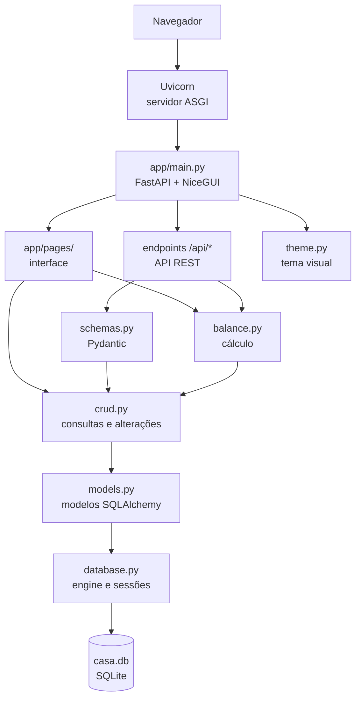
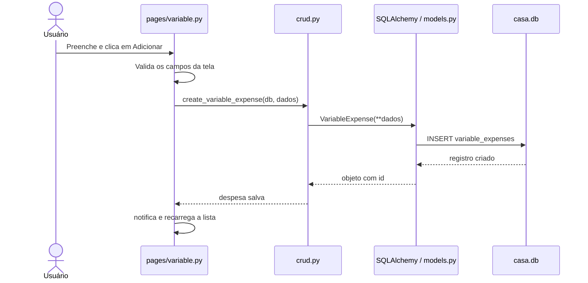
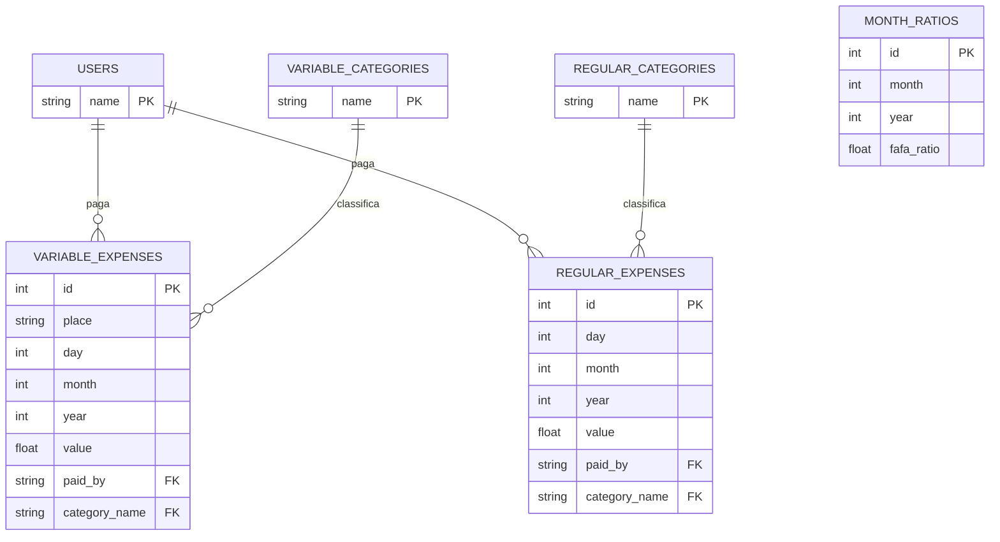

# Guia do código — Mansão Fefael

Este guia descreve o código que está no repositório hoje. Use-o para saber por
onde seguir uma funcionalidade e em qual arquivo fazer cada tipo de mudança.

## Visão geral

O projeto é um **monólito Python**: interface web, API e acesso ao banco
rodam juntos. Ele registra despesas variáveis e fixas, aplica uma proporção
mensal de pagamento e calcula o saldo entre Fafa e Fefe.



### A observação mais importante

As páginas NiceGUI chamam `crud.py` diretamente. Clicar em **Adicionar** não
faz um `POST` para a API: uma função Python da página abre uma sessão e chama
uma função CRUD. Já um cliente externo (por exemplo, um app mobile) usaria os
endpoints `/api/*`, que passam por `schemas.py` antes de chegar ao CRUD.

## Tecnologias e dependências

| Tecnologia | Papel | Onde aparece |
| --- | --- | --- |
| Python 3.10+ | Linguagem do servidor | todos os `.py` |
| FastAPI | API HTTP e ciclo de vida | `main.py` |
| Uvicorn | Servidor que executa FastAPI | comando de execução |
| NiceGUI | Interface web criada com Python | `main.py`, `pages/`, `theme.py` |
| SQLAlchemy | ORM e consultas | `database.py`, `models.py`, `crud.py` |
| SQLite | Banco local em arquivo único | `casa.db` |
| Pydantic | Validação de entrada e saída da API | `schemas.py` |

**ORM** significa *Object-Relational Mapper*: você cria um objeto Python como
`VariableExpense`, e o SQLAlchemy o converte no SQL necessário para salvar ou
consultar dados.

## Fluxo de um gasto variável



Para mudar a experiência dessa tela, comece em `pages/variable.py`. Para mudar
a estrutura persistida, comece em `models.py`. Para mudar a consulta ou
operação no banco, use `crud.py`.

## Dados armazenados



`ForeignKey` cria uma dependência entre tabelas: um gasto só pode apontar para
um usuário e uma categoria existentes. `MonthRatio` armazena apenas o
percentual de Fafa; o de Fefe é calculado como `1 - fafa_ratio`.

## Responsabilidade de cada arquivo

| Arquivo | Responsabilidade | Altere quando quiser... |
| --- | --- | --- |
| `main.py` | inicialização, API e URLs | adicionar página ou endpoint |
| `database.py` | conexão SQLite e sessões | trocar banco ou controlar transações |
| `models.py` | tabelas, relações e restrições | criar coluna/tabela/regra de integridade |
| `schemas.py` | contrato e validação da API | validar novo campo HTTP |
| `crud.py` | criar, consultar, atualizar e apagar | nova operação no banco |
| `balance.py` | fórmula do rateio e saldo | mudar o cálculo financeiro |
| `pages/home.py` | painel inicial | alterar o resumo mensal |
| `pages/variable.py` | gastos variáveis | alterar formulário/lista de variáveis |
| `pages/regular.py` | gastos fixos | alterar despesas recorrentes |
| `pages/balance.py` | proporção e saldo | alterar a tela de balanço |
| `theme.py` | CSS e tema claro/escuro | mudar aparência global |
| `seed.py` | usuários e categorias iniciais | mudar os dados de um banco novo |

## Blocos de código para dominar

### Ciclo de vida do servidor

```python
@asynccontextmanager
async def lifespan(app: FastAPI):
    init_db()
    with get_session() as db:
        crud.autofill_current_month_regular_expenses(db)
    yield
```

Isso roda na inicialização. `init_db()` cria tabelas inexistentes; a função
seguinte copia despesas fixas do mês anterior quando necessário. `yield` entrega
o controle ao servidor. O `with` sempre fecha a sessão, mesmo com erro.

### Sessão de banco

```python
with get_session() as db:
    expenses = crud.get_variable_expenses(db, month=8, year=2026)
```

`db` é uma `Session`: o objeto temporário usado para conversar com o banco. O
contexto `with` garante o fechamento da conexão após a consulta.

### Criação de um registro

```python
expense = VariableExpense(**data)
db.add(expense)
db.commit()
db.refresh(expense)
```

`**data` descompacta um dicionário em argumentos nomeados. `add` prepara o
objeto, `commit` confirma a alteração e `refresh` recarrega valores gerados
pelo banco, como `id` e `created_at`.

### Validação da API

```python
class VariableExpenseCreate(BaseModel):
    value: float = Field(..., gt=0)
    paid_by: str = Field(..., pattern="^(FAFA|FEFE)$")
```

Antes de um endpoint FastAPI executar, Pydantic valida esses campos. Uma
requisição com valor inválido recebe erro HTTP 422. Atenção: a interface atual
não passa por esse schema; ela tem validações manuais em suas páginas.

### Fórmula do saldo

```python
total = totals["variable_total"] + totals["regular_total"]
fafa_should = total * ratio.fafa_ratio
balance = totals["fafa_paid"] - fafa_should
```

Saldo positivo significa que Fafa pagou mais que sua parte. Saldo negativo
significa que Fafa pagou menos e deve o valor absoluto a Fefe.

## Melhorias recomendadas

1. **Dinheiro:** trocar `float` por `Decimal` ou centavos inteiros. `float`
   pode ter imprecisões de arredondamento.
2. **Testes:** comece por `calculate_monthly_balance` e
   `autofill_current_month_regular_expenses`, pois são regras importantes e
   independem do navegador.
3. **Regras compartilhadas:** criar uma camada de serviço entre UI/API e CRUD.
   Assim as duas entradas usam as mesmas validações.
4. **Migrações:** adotar Alembic. `create_all()` cria tabelas, mas não controla
   mudanças em bancos já existentes.
5. **Configuração:** desligar `echo=True` em produção; ele imprime SQL e dados
   no terminal.
6. **Interface:** remover os anos fixos de `variable.py` e gerar opções a
   partir do ano atual.
7. **Exclusão:** trocar o campo manual de ID por botão por linha, com
   confirmação.

## Roteiro de estudo

1. Leia `main.py` e navegue pelas URLs registradas por `@ui.page`.
2. Siga `add_expense` em `pages/variable.py` até
   `crud.create_variable_expense`.
3. Leia os modelos correspondentes em `models.py`.
4. Faça uma mudança visual pequena em `theme.py`.
5. Faça uma mudança funcional pequena na página.
6. Escreva um teste para a mudança antes de partir para uma refatoração maior.

## Comandos úteis

```bash
uvicorn app.main:app --reload
```

Inicia o servidor local. `app.main:app` importa o objeto `app` do arquivo
`app/main.py`; `--reload` reinicia o servidor quando arquivos Python mudam.

```bash
python -m app.seed
```

Executa `app.seed` como programa e insere os usuários e categorias iniciais em
um banco vazio.
